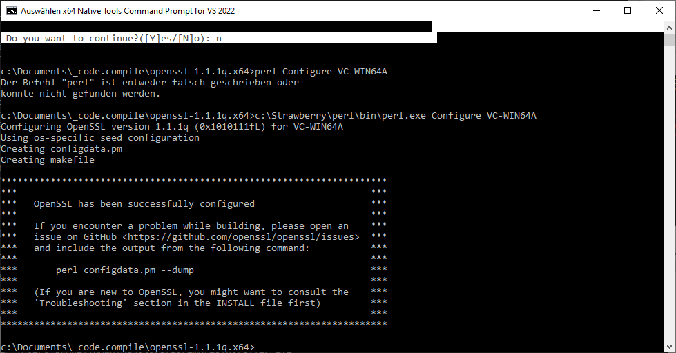
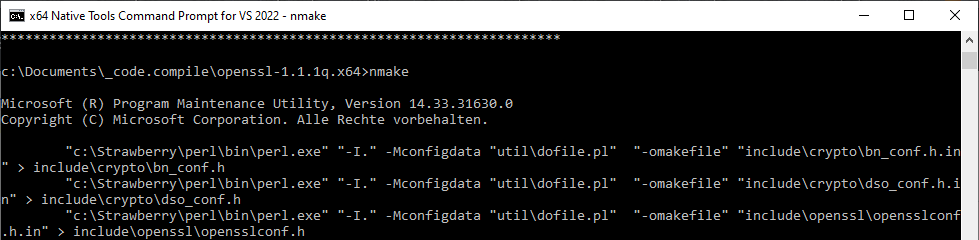

### 1. Directory Structure

The Final Directory Structure looks like this:

\.\\ntp-4.2.8p15

\.\\openssl-1.1.1q.x64

\.\\openssl-1.1.1q.x86

### 2. Open SSL

1\. read Instructions

<https://wiki.openssl.org/index.php/Compilation_and_Installation>

and

<https://gist.github.com/csm10495/12bb15d8d76ce2ce4df4d9a72dacc536>

Required: Visual Studio 2015 or 2017 (or probably later works)

> Required: Visual Studio 2015 or 2017 (or probably later works)
>
> Setup
> 1. Clone/download OpenSSL 1.1.1 source to a folder
> 2. Download / install Perl (They recommend Active perl)
>    I recommend using Chocolatey so for me: choco install activeperl
> 3. Ensure Perl is in the system path. (Choco appears to do this by default)
> 4. Download / install NASM
>    I recommend using Chocolatey so for me: choco install nasm
> 5. Ensure NASM is in the system path. (For me the directory to add was C:\Program Files\NASM)
> 6. Duplicate the OpenSSL folder into one for x64 and one for x86
> 
> Building Debug/Release Static/Shared x64/x86
> 
> x86
> 1. Open a Visual Studio Build Tools Command Prompt (Start->All Programs->Visual Studio 20**->Visual Studio Tools->VC->x86 Native Tools Command Prompt for...)
> 2. cd to your OpenSSL x86 folder (you created in Setup.6)
> 3. Run: perl Configure VC-WIN32   (add no-shared if you just want a static build)
> 4. Run: nmake   (this will take a bit)
> 5. Run: nmake test (this will take a bit too)
> 6. If everything went well, you have a binary in /apps and libs in the root of you x86 folder (both static and dynamic release)
> 7. Save off the built things you want to save (since they will be deleted in a moment)
> 8. Run: nmake clean
> 9: Run: perl Configure VC-WIN32 --debug  (add no-shared if you just want a static build)
> 10. Run: nmake   (this will take a bit)
> 11. Run: nmake test (this will take a bit too)
> 12. If everything went well, you have a binary in /apps and libs in the root of you x86 folder (both static and dynamic debug versions)
> 13. Save off the built things you want to save (I recommend putting them somewhere different from the release versions since they will have the same names)
> 
> For x64, follow the x86 steps except:
> 1. Replace x86 with x64 in: Steps 1,2,6,12
> 2. Replace VC-WIN32 with VC-WIN64A in steps 3 and 9
> 
> Note that there are (minor) differences in headers between x64 and x86 so you should save 2 include directories.


2\. Install Perl

ActivePerl was a mess:

-   Choco installer does not work anymore

-   Active Perl manual installation (old version with MSI) did not work

-   The new version of Active was horror to install and I gave up after
    1h trying to get just "perl" to run in console

-   I used Strawberry Perl at the end

3\. Install NASM

4\. Download OpenSSL

I downloaded Archive from OpenSSL and unpacked it to openssl-1.1.1q.x64
for x64

 <https://www.openssl.org/source/>

 file:

 <https://www.openssl.org/source/openssl-1.1.1q.tar.gz>

 or use GIT

git clone git://git.openssl.org/openssl.git

> Access to specific branches is possible via the standard branch and
> checkout commands. See the discussion of branch naming below for more
> information.
>
> On Windows, once the repository is cloned, you should ensure that line
> endings are set correctly:

\$ cd openssl

\$ git config core.autocrlf false

\$ git config core.eol lf

\$ git checkout .

5\. Compile as in instructions

Followed the instructions worked fine:





### 2. NTP compile in VS2022:

1.  download NTP

<http://www.ntp.org/downloads.html>

file:

http://www.eecis.udel.edu/\~ntp/ntp_spool/ntp4/ntp-4.2/ntp-4.2.8p15.tar.gz

2.  Unpack it

3.  Replace files with my git repository or follow steps below:

4.  Navigate to directory ntp-4.2.8p15\\ports\\winnt\\vs2015

5.  Clone that directory to VS2022 (as it will migrate to VS2022 and
    overwrite 2015 settings)

6.  Open ntp-4.2.8p15\\ports\\winnt\\vs2022\\ntp.sln

7.  Migration Wizard will start

> Changed solution to "Visual Studio 2019 (v142)" as Visual Studio
> suggested

8.  Fix directories to use OpenSSH as compiled before in the projects

Include openssl-1.1.1q.x64 to VC++ Directories in Library and Include
Files


9.  Fix "**noreturn**" in the code, this will render it to be not
    compatible with other compilers anymore

> The code uses noreturn and I could not find out how to fix it
> properly, however changing code worked like described in following
> article:

<https://www.open-std.org/jtc1/sc22/wg14/www/docs/n1453.htm>


>  Cross-platform
> 
> Employing the noreturn property on cross-platform code therefore
> requires some simple macro substitution:
> 
> \#if \_MSC_VER \>= 1310
> 
> /\* MS Visual Studio 2003/.NET Framework 1.1 or newer \*/
> 
> \#define NORETURN \_declspec( noreturn)
> 
> \#if \_\_GNUC\_\_ \> 2 \|\| (\_\_GNUC\_\_ == 2 &&
> (\_\_GNUC_MINOR\_\_ \>= 5)
> 
> /\* GCC 2.5 or newer \*/
> 
> \#define NORETURN \_\_attribute\_\_ ((noreturn))
> 
> \#elif \_\_cplusplus \>= ???
> 
> // ??? = the value \[tbd\] specified in C++0x 16.8
> 
> \#define NORETURN \[\[noreturn\]\]
> 
> \#elif \_\_STDC_VERSION\_\_ \>= 201ymmL
> 
> // the value specified in C1x 6.10.8)
> 
> \#define NORETURN \_Noreturn
> 
> \#else
> 
> \#define NORETURN ???
> 
> // (my project\'s choice: \#error, or nothing)
> 
> \#endif
> 
> Hence you can use the NORETURN macro to specify the noreturn
> property in portable code:
> 
> NORETURN void fn(void);
> 
> NORETURN void fn(void) {exit(1);}


Files affected to support noreturn without compile error in libntp
project, new files are in ntp-4.2.8p15\\ports\\winnt\\sntp\\libopts :

Changes in ntp-4.2.8p15\\ports\\winnt\\sntp\\libopts\\proto.h to original in ntp-4.2.8p15\\sntp\\libopts\\proto.h (it is used by sntp\\libopts\\libopts.c)

```c
/* -*- buffer-read-only: t -*- vi: set ro:
 *
 * Prototypes for autoopts
 * Generated Sat Apr 25 09:53:18 PDT 2015
 */
#ifndef AUTOOPTS_PROTO_H_GUARD
#define AUTOOPTS_PROTO_H_GUARD 1

//Change to work with Visual Studio Comunity 2022
#if _MSC_VER >= 1310 
 /* MS Visual Studio 2003/.NET Framework 1.1 or newer */
#define NORETURN _declspec( noreturn)
#endif

/*
 *  Extracted from alias.c
 */

```

```c
/*
 *  Extracted from makeshell.c
 */
static NORETURN void
option_exits(int exit_code);

static NORETURN void
ao_bug(char const * msg);

static void
fserr_warn(char const * prog, char const * op, char const * fname);

static NORETURN void
fserr_exit(char const * prog, char const * op, char const * fname);

/*
 *  Extracted from nested.c
 */
```

Changes in ntp-4.2.8p15\\ports\\winnt\\sntp\\libopts\\libopts.c to original in sntp\\libopts\\libopts.c

```c
#define  AUTOOPTS_INTERNAL 1
#include "../../../../sntp/libopts/autoopts/project.h"
#define  LOCAL static
#include "../../../../sntp/libopts/ao-strs.h"
static char const ao_ver_string[] =
    "41:0:16\n";
#include "../../../../sntp/libopts/autoopts/options.h"
#include "../../../../sntp/libopts/autoopts/usage-txt.h"
#include "../../../../sntp/libopts/genshell.h"
#include "../../../../sntp/libopts/option-xat-attribute.h"
#include "../../../../sntp/libopts/option-value-type.h"
#include "../../../../sntp/libopts/ao-strs.h"
#include "../../../../sntp/libopts/ag-char-map.h"
#include "../../../../sntp/libopts/autoopts.h"
#include "proto.h"
#include "../../../../sntp/libopts/parse-duration.c"
#include "../../../../sntp/libopts/ao-strs.c"
#include "../../../../sntp/libopts/option-value-type.c"
#include "../../../../sntp/libopts/option-xat-attribute.c"
#include "../../../../sntp/libopts/autoopts.c"
#include "../../../../sntp/libopts/alias.c"
#include "../../../../sntp/libopts/boolean.c"
#include "../../../../sntp/libopts/check.c"
#include "../../../../sntp/libopts/configfile.c"
#include "../../../../sntp/libopts/cook.c"
#include "../../../../sntp/libopts/enum.c"
#include "../../../../sntp/libopts/env.c"
#include "../../../../sntp/libopts/file.c"
#include "../../../../sntp/libopts/find.c"
#include "../../../../sntp/libopts/genshell.c"
#include "../../../../sntp/libopts/load.c"
#include "makeshell.c"
#include "../../../../sntp/libopts/nested.c"
#include "../../../../sntp/libopts/numeric.c"
#include "../../../../sntp/libopts/pgusage.c"
#include "../../../../sntp/libopts/putshell.c"
#include "../../../../sntp/libopts/reset.c"
#include "../../../../sntp/libopts/restore.c"
#include "../../../../sntp/libopts/save.c"
#include "../../../../sntp/libopts/sort.c"
#include "../../../../sntp/libopts/stack.c"
#include "../../../../sntp/libopts/streqvcmp.c"
#include "../../../../sntp/libopts/text_mmap.c"
#include "../../../../sntp/libopts/time.c"
#include "../../../../sntp/libopts/tokenize.c"
#include "../../../../sntp/libopts/usage.c"
#include "../../../../sntp/libopts/version.c"
#include "../../../../sntp/libopts/init.c"
```

and changes in ntp-4.2.8p15\\ports\\winnt\\sntp\\libopts\\makeshell.c to original in ntp-4.2.8p15\\sntp\\libopts\\makeshell.c (all occurrences of noreturn to NORETURN)

```c
/* = = = END-STATIC-FORWARD = = = */

LOCAL NORETURN void
option_exits(int exit_code)
{
    if (print_exit)
        printf("\nexit %d\n", exit_code);
    exit(exit_code);
}

LOCAL NORETURN void
ao_bug(char const * msg)
{
    fprintf(stderr, zao_bug_msg, msg);
    option_exits(EX_SOFTWARE);
}

LOCAL void
fserr_warn(char const * prog, char const * op, char const * fname)
{
    fprintf(stderr, zfserr_fmt, prog, errno, strerror(errno),
            op, fname);
}

LOCAL NORETURN void
fserr_exit(char const * prog, char const * op, char const * fname)
{
    fserr_warn(prog, op, fname);
    option_exits(EXIT_FAILURE);
}


```

10. Set Compile settings to release and x64


11. Compile

========== Build: 9 succeeded, 0 failed, 0 up-to-date, 0 skipped
==========

Output will be in ntp-4.2.8p15\\ports\\winnt\\vs2022\\x64-out\\Release

12. Done!
